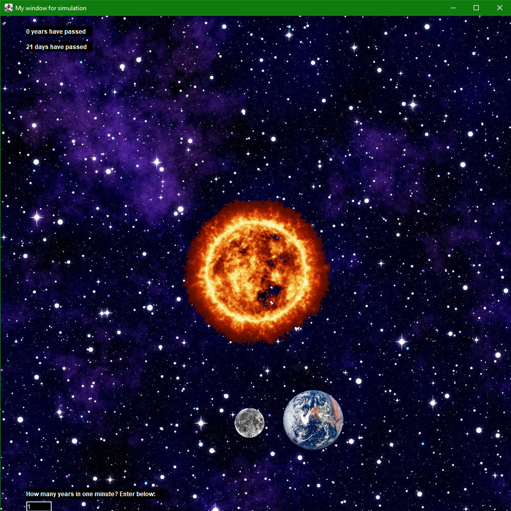

# Rotation-Simulation
This is a simulation of Earth orbiting the Sun.  
The rotation of Earth and Moon are appropriate to time of 24h Earth day.  
## How to use
To clone and run this application, you'll need JDK installed on your computer.  
You can change the speed of simulation by entering values in range of 0.3 - 10.0 in the text field.  
This application works in window with dimensions of 1000x1000.  
Below you have a screenshot and link to youtube where you can see how it works.  
  
https://www.youtube.com/watch?v=DodqPkF8csE  
## Technologies
* Java 15
